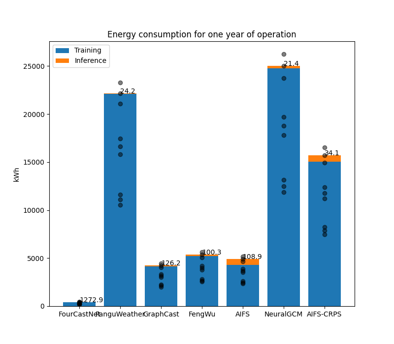

# Energy and carbon footprint considerations for data-driven weather forecasting models

The use of data-driven models for weather forecasting often displays impressive gains in computation time and energy-efficiency.
However, these gains do not include the training phase of the models, which is notoriously more costly than the inference. This study gathers information from the literature about training and inference computation costs to estimate the energy and carbon footprint of data-driven models compared to a physics-based counterpart.
Despite being considerably more costly than a physics-based forecast, the training is rapidly compensated by the savings made during the inference.
For a use-case corresponding to one year of use, six data-driven models (FourCastNet, PanguWeather, GraphCast, FengWu, AIFS, NeuralGCM) are estimated to be 21 to 1272 times more energy-efficient than the physics-based model.
Consequently, data-driven models offer opportunities to significantly reduce the carbon footprint of weather forecasting.

## Installation

This application contains no package. To be used within a Python installation providing the following packages:

### Dependencies
  * numpy
  * matplotlib
  * pandas
  * codecarbon

### Getting started

Once the dependencies are installed, the documentation of the main program can be accessed as follows.

```
$ python main.py -h
usage: main.py [-h] [--nruns NRUNS] [--nmembers NMEMBERS] [--countries COUNTRIES] [--train-country TRAIN_COUNTRY] [--infer-country INFER_COUNTRY] [--savefig] [--figdir FIGDIR] [--figfmt FIGFMT]

Reproduce the figures and the calculation given in the article.

optional arguments:
  -h, --help            show this help message and exit
  --nruns NRUNS         The number of runs to make in the use-case (one year of forecast twice a day: 2*365=730)
  --nmembers NMEMBERS   The size of the ensemble
  --countries COUNTRIES
                        Countries to put in the carbon footprint table (comma-separated 3-letter ISO codes. Ex: NOR,ITA,POL,USA,CHN)
  --train-country TRAIN_COUNTRY
                        Last column of the carbon footprint table: country in which training is done
  --infer-country INFER_COUNTRY
                        Last column of the carbon footprint table: country in which inference is done
  --savefig             Save the figures instead of plotting them
  --figdir FIGDIR       Output directory for figures
  --figfmt FIGFMT       Format for the figures (png, svg)

Example: python main.py --nruns 365 --nmembers 51 --savefig --figmt svg
```


## Results

The main results of the study are the **tables**, the **bar chart** of the energy consumption for one year of use and the **carbon intensity map**.
They can be reproduced with the default arguments of the main program.
```
python main.py
```

### Tables

Table 1: INPUT DATA

| name | inference_time | training_time | n_gpus_training | hardware | tdp | doi |
| :--: | :------------: | :-----------: | :-------------: | :------: | :-: | :-: |
| FourCastNet | 2.8 | 57600.0 | 64.0 | A100 | 400.0 | 10.48550/arXiv.2202.11214 |
| PanguWeather | 14.0 | 1382400.0 | 192.0 | V100-SMX2 | 300.0 | 10.48550/arXiv.2211.02556 |
| GraphCast | 60.0 | 2419200.0 | 32.0 | TPUv4 | 192.0 | 10.48550/arXiv.2212.12794 |
| FengWu | 30.0 | 1468800.0 | 32.0 | A100 | 400.0 | 10.48550/arXiv.2304.02948 |
| AIFS | 150.0 | 604800.0 | 64.0 | A100 | 400.0 | 10.48550/arXiv.2406.01465 |
| NeuralGCM | 119.0 | 1814400.0 | 256.0 | TPUv4 | 192.0 | 10.48550/arXiv.2311.07222 |


Table 2: OUTPUT DATA

| name | inference_energy_Wh | nrjratio_ifs_inference | training_energy_kWh | nrjratio_training_ifs | payback_days_51mb | largest_ensemble |
| :--: | :-----------------: | :--------------------: | :-----------------: | :-------------------: | :---------------: | :--------------: |
| FourCastNet | 0.3 | 46285.7 | 409.6 | 28.4 | 0.3 | 2360571.4 |
| PanguWeather | 1.2 | 12342.9 | 22118.4 | 1536.0 | 15.1 | 629485.7 |
| GraphCast | 3.2 | 4500.0 | 4128.8 | 286.7 | 2.8 | 229500.0 |
| FengWu | 3.3 | 4320.0 | 5222.4 | 362.7 | 3.6 | 220320.0 |
| AIFS | 16.7 | 864.0 | 4300.8 | 298.7 | 2.9 | 44064.0 |
| NeuralGCM | 6.3 | 2268.9 | 24772.6 | 1720.3 | 16.9 | 115714.3 |


Table 3: CARBON FOOTPRINTS

| name | tco2_oneyearoper_NOR | tco2_oneyearoper_ITA | tco2_oneyearoper_POL | tco2_oneyearoper_USA | tco2_oneyearoper_CHN | tco2_train_NOR_infer_POL |
| :--: | :------------------: | :------------------: | :------------------: | :------------------: | :------------------: | :----------------------: |
| FourCastNet | 0.0 | 0.1 | 0.3 | 0.2 | 0.2 | 0.0 |
| PanguWeather | 0.6 | 5.0 | 16.4 | 8.4 | 12.1 | 0.6 |
| GraphCast | 0.1 | 1.0 | 3.1 | 1.6 | 2.3 | 0.2 |
| FengWu | 0.1 | 1.2 | 4.0 | 2.0 | 2.9 | 0.2 |
| AIFS | 0.1 | 1.1 | 3.6 | 1.9 | 2.7 | 0.6 |
| NeuralGCM | 0.7 | 5.7 | 18.5 | 9.5 | 13.6 | 0.8 |
| IFS | 14.2 | 121.3 | 396.4 | 203.5 | 291.8 | - |

### Carbon intensity map


### Energy consumption for one year of use


